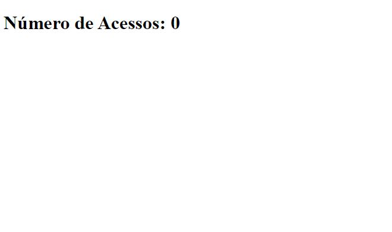

# Contador de Visitas Básico com PHP

## Sobre o projecto

Esse é apenas um exemplo básico para contar o número de visitas na página utilizando PHP. Dependendo das suas necessidades, pode ser necessário implementar técnicas adicionais, como armazenar as visitas em um banco de dados para um controle mais preciso e duradouro.